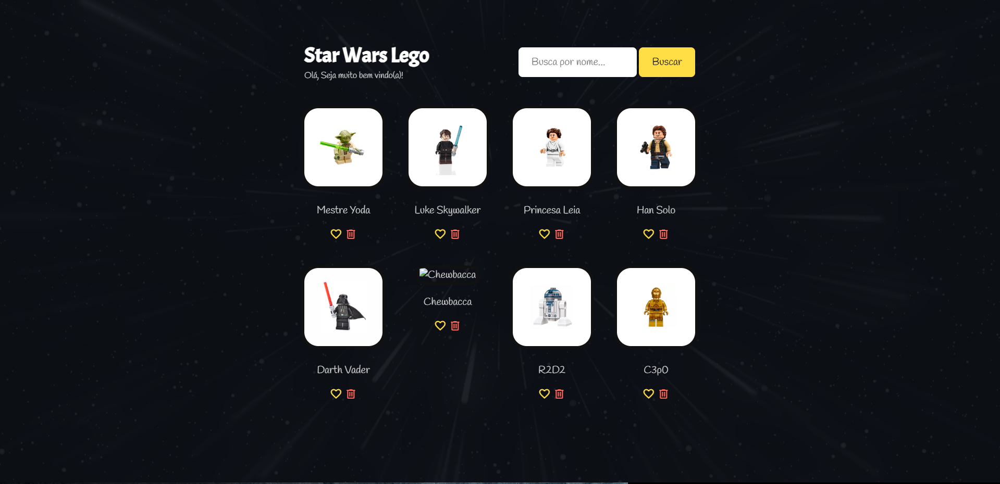
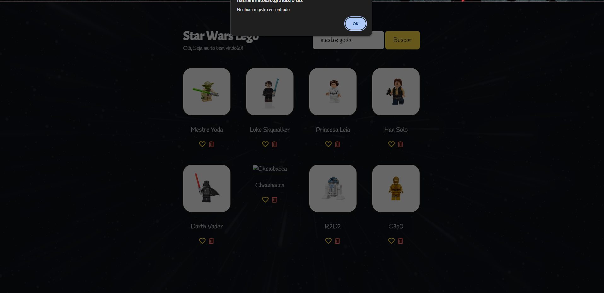
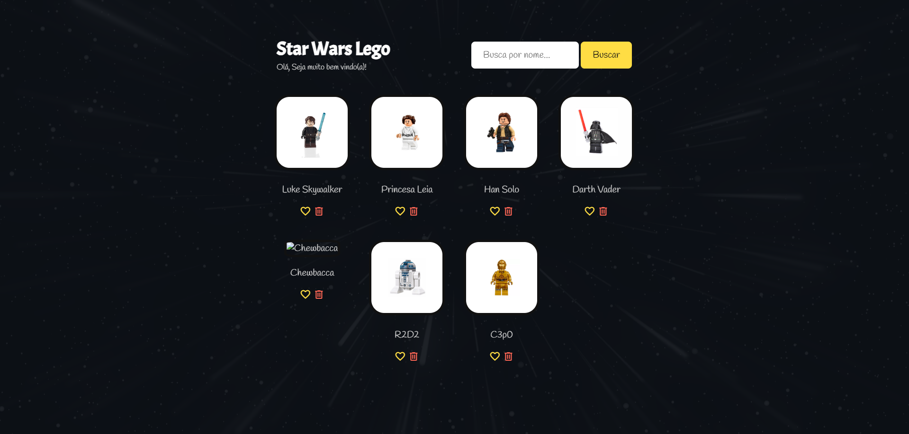
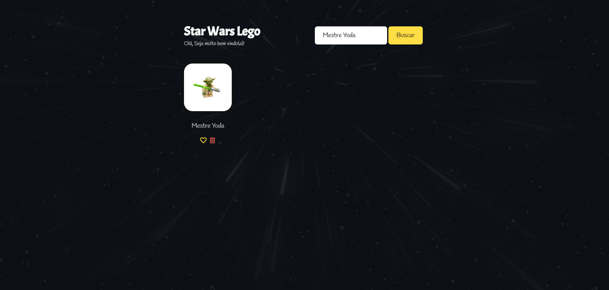
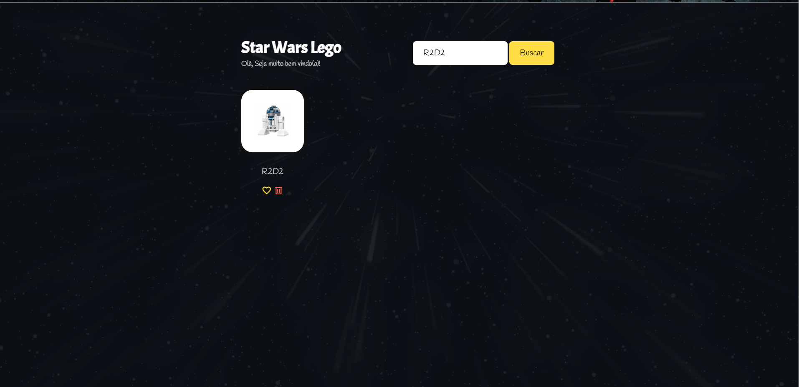
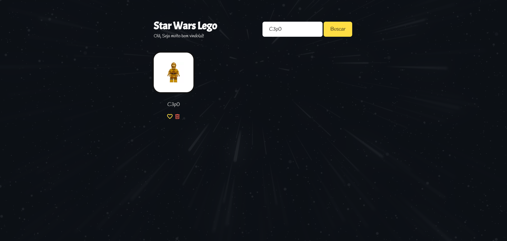
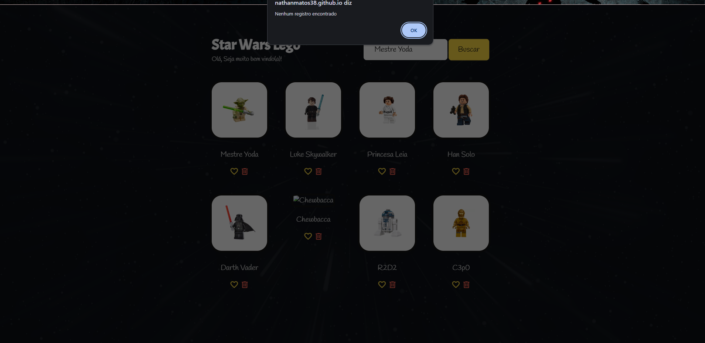

# 🧪 QA — Star Wars LEGO

Documentação da análise de qualidade da versão publicada da aplicação antes da implementação das correções.

---

## 🎯 1. Objetivo

Validar a versão publicada da aplicação **Star Wars LEGO** antes da implementação de correções.

O objetivo é identificar e analisar falhas, erros, inconsistências e comportamentos inesperados, verificando o comportamento das principais funcionalidades da aplicação, tais como:

* Busca de personagens;
* Exclusão de personagens;
* Funcionalidade de curtir;
* Responsividade.

---

## 📋 2. Escopo

Foi criado um conjunto de casos de teste e percorrido um caminho organizado para possibilitar a análise objetiva das principais funcionalidades da aplicação.

A execução da suíte foi dividida em seis grupos de testes, abrangendo diferentes tipos de cenários:

### Grupo 1 — Happy Path

O **Happy Path (caminho feliz)** foi utilizado como ponto inicial da execução para validar o comportamento esperado das principais funcionalidades antes da exploração de cenários alternativos e negativos.

Nessa etapa, foram validados cenários de sucesso para a busca dos personagens disponíveis na aplicação.

### Grupo 2 — Variações de Entrada

Foram exploradas diferentes variações nas entradas da funcionalidade de busca, incluindo limites, variações de capitalização e espaços em branco, com o objetivo de identificar possíveis falhas nos resultados apresentados.

### Grupo 3 — Entradas Inválidas / Sem Correspondência

Foram exploradas entradas contendo números e caracteres especiais, com o objetivo de verificar o comportamento da busca diante de entradas sem correspondência com os personagens disponíveis.

### Grupo 4 — Exclusão

Foi explorada a funcionalidade de exclusão de personagens.

Nessa etapa, foi validado o comportamento apresentado após a exclusão de um personagem e realizada uma nova busca pelo personagem removido, verificando se o registro continuava disponível durante a sessão.

### Grupo 5 — Curtir

Foi explorada a funcionalidade de curtir personagens, validando o comportamento apresentado ao usuário ao realizar essa ação.

### Grupo 6 — Responsividade

Foram exploradas diferentes larguras de tela para verificar a responsividade da aplicação, observando as alterações de layout e a utilização das funcionalidades em cada viewport testada.

---

## 🖥️ 3. Ambiente de Testes

### Aplicação

A aplicação utilizada nos testes foi a versão publicada através do **GitHub Pages**.

### Navegador

**Google Chrome** — Versão 151.0.7922.138 (Compilação oficial) (64 bits).

### Ferramenta

Para testar o comportamento da aplicação em diferentes tamanhos de viewport, foi utilizada a ferramenta **DevTools**, especificamente o **Device Mode**, que permite simular diferentes larguras de tela.

### Viewports testadas

| Viewport | Largura x Altura |
| -------- | ---------------: |
| Desktop  |       1440 × 842 |
| Desktop  |       1024 × 842 |
| Tablet   |        768 × 842 |
| Mobile   |        425 × 842 |
| Mobile   |        375 × 842 |
| Mobile   |        320 × 842 |

### Versão avaliada

A versão analisada corresponde à aplicação publicada antes da implementação das correções.

**Aplicação:** [Star Wars LEGO — GitHub Pages](https://nathanmatos38.github.io/star-wars-lego/)

---

## ⚙️ 4. Regras Funcionais Identificadas

Durante a exploração da aplicação e elaboração dos cenários de teste, foram identificadas as seguintes regras funcionais:

### RF-001 — Pesquisa de personagens

O usuário pode pesquisar personagens por meio do campo de busca.

### RF-002 — Busca independente de maiúsculas e minúsculas

A busca deve retornar o personagem independentemente da utilização de letras maiúsculas ou minúsculas na entrada.

**Exemplos:** `Mestre Yoda`, `mestre yoda` e `MESTRE YODA`.

### RF-003 — Reconhecimento de caracteres numéricos

A busca deve reconhecer caracteres numéricos como parte válida do nome do personagem.

**Exemplos:** `R2D2` e `C3p0`.

### RF-004 — Tratamento de caracteres especiais

A busca deve processar entradas contendo caracteres especiais sem gerar comportamento inesperado, retornando **"Nenhum registro encontrado"** quando não houver correspondência.

### RF-005 — Desconsideração de espaços

A busca deve desconsiderar espaços em branco no início e no final da entrada.

**Exemplos:** `" Mestre Yoda"` e `"Mestre Yoda "`.

### RF-006 — Campo de busca obrigatório

Quando o campo de busca não for preenchido, o sistema deve informar que o campo é obrigatório.

### RF-007 — Busca sem correspondência

Quando a busca não possuir correspondência com nenhum personagem, o sistema deve informar que nenhum registro foi encontrado.

### RF-008 — Exclusão de personagens

O sistema deve excluir o personagem quando o usuário clicar na lixeira correspondente ao personagem.

### RF-009 — Persistência da exclusão durante a sessão

Após a exclusão, o personagem não deve aparecer novamente em uma nova busca durante a sessão atual.

### RF-010 — Restauração após atualização ou reabertura

Após atualizar a página ou reabrir a aplicação, os personagens previamente excluídos devem estar novamente disponíveis.

### RF-011 — Curtir personagem

Ao clicar no coração de um personagem, o sistema deve apresentar um alerta informando que aquele personagem recebeu um like e incluir o nome correspondente na mensagem.

### RF-012 — Responsividade

A aplicação deve adaptar sua apresentação visual às diferentes larguras de viewport testadas, mantendo campos e funcionalidades utilizáveis.

---

## 🧪 5. Estratégia de Testes

A estratégia foi definida com base nas funcionalidades apresentadas pela aplicação e nas regras funcionais identificadas durante a exploração.

Inicialmente, foram realizados **testes exploratórios** com o objetivo de compreender as funcionalidades disponíveis na aplicação. Após esse primeiro contato, foram elaborados os possíveis cenários de teste e organizada a sequência de execução.

Os cenários começaram pelo **Happy Path**, utilizado para validar inicialmente se as principais funcionalidades apresentavam o comportamento esperado.

Após a validação dos cenários de sucesso, foram exploradas diferentes variações de entrada. Essa etapa foi importante para identificar inconsistências na funcionalidade de busca e registrar as falhas encontradas.

Também foram avaliados comportamentos negativos, como o preenchimento incorreto ou não preenchimento do campo de busca e pesquisas sem correspondência.

Após a validação da busca, foi avaliada a funcionalidade de **exclusão de personagens**. Durante essa etapa, após excluir um personagem, foi realizada uma nova busca pelo personagem removido. O comportamento observado foi a reaparição do personagem nos resultados da pesquisa. A partir dessa inconsistência, foram realizados testes adicionais envolvendo diferentes personagens.

Na sequência, foi avaliada a funcionalidade de **curtir personagens**, documentando e testando o comportamento apresentado ao usuário após a ação.

Por fim, foi realizada a análise de **responsividade**, verificando o comportamento da aplicação em diferentes tamanhos de tela. Foram observados campos, imagens, botões, distribuição dos elementos e funcionamento das principais funcionalidades em cada viewport testada.

Ao final, foram organizados os casos de teste que compõem toda essa jornada de análise, estabelecendo a baseline da aplicação antes da implementação das correções.

---

## ▶️ 6. Execução dos Testes

A execução foi realizada com base nos **29 casos de teste previamente definidos**, contemplando os diferentes cenários funcionais e de responsividade estabelecidos para a aplicação.

Os 29 casos de teste foram separados em seis grupos, com diferentes definições e tipos de cenário. Todos os grupos foram executados integralmente e em ordem, sem exceções.

### 📊 Resultado por grupo

| Grupo     | Cenário                                  |   PASS |  FAIL |  Total |
| --------- | ---------------------------------------- | -----: | ----: | -----: |
| G1        | Happy Path                               |      8 |     0 |      8 |
| G2        | Variações de Entrada                     |      2 |     4 |      6 |
| G3        | Entradas Inválidas / Sem Correspondência |      3 |     0 |      3 |
| G4        | Exclusão                                 |      0 |     3 |      3 |
| G5        | Curtir                                   |      3 |     0 |      3 |
| G6        | Responsividade                           |      6 |     0 |      6 |
| **Total** |                                          | **22** | **7** | **29** |

### 📈 Resultado geral da suíte

Foram executados **29 testes**, com o seguinte resultado:

* ✅ **22 PASS**
* ❌ **7 FAIL**
* ⚪ **0 BLOCK**

A taxa de aprovação foi de aproximadamente **75,9%**, enquanto a taxa de falha foi de aproximadamente **24,1%**.

Os **7 casos de teste que retornaram FAIL** estão relacionados aos bugs identificados e são detalhados na seção seguinte.

> **Observação:** o BUG-001 foi identificado durante a inspeção exploratória inicial da aplicação e, por esse motivo, não está associado a um caso de teste formal da suíte de 29 testes.

---

## 🐛 7. Bugs Encontrados

Durante a exploração e execução dos testes foram identificados quatro bugs na versão avaliada.

### BUG-001 — Imagem do Chewbacca não carregada

O BUG-001 foi identificado durante a inspeção exploratória inicial da aplicação. Por esse motivo, não está associado a um caso de teste formal da suíte executada.

A falha está relacionada ao carregamento da imagem do personagem Chewbacca na aplicação publicada.

---

### BUG-002 — Busca sensível a maiúsculas e minúsculas

**Casos de teste relacionados:** G2-TC-004

No segundo grupo, denominado **Variações de Entrada**, foi identificada uma divergência relacionada à diferenciação entre letras maiúsculas e minúsculas na busca.

#### G2-TC-004 — Buscar "Mestre Yoda"

**Entrada:** `MESTRE YODA`

**Ação:** Clicar em Buscar.

**Resultado atual:** Nenhum registro encontrado.

**Resultado esperado:** Aparição do personagem Mestre Yoda.

**Status:** ❌ FAIL

---

### BUG-003 — Exclusão não persistente durante a sessão

O comportamento foi inicialmente identificado durante a exploração manual e posteriormente confirmado pelos casos de teste.

**Casos de teste relacionados:**

* G4-TC-001 — Excluir Mestre Yoda
* G4-TC-002 — Excluir R2D2
* G4-TC-003 — Excluir C3p0

#### G4-TC-001 — Excluir Mestre Yoda

**Ação:** Clicar na lixeira do Mestre Yoda.

**Ação:** Pesquisar Mestre Yoda.

**Ação:** Clicar em Buscar.

**Resultado atual:** Aparição do personagem.

**Resultado esperado:** Nenhum registro encontrado, pois o personagem foi excluído.

**Status:** ❌ FAIL

#### G4-TC-002 — Excluir R2D2

**Ação:** Clicar na lixeira do R2D2.

**Ação:** Pesquisar R2D2.

**Ação:** Clicar em Buscar.

**Resultado atual:** Aparição do personagem.

**Resultado esperado:** Nenhum registro encontrado, pois o personagem foi excluído.

**Status:** ❌ FAIL

#### G4-TC-003 — Excluir C3p0

**Ação:** Clicar na lixeira do C3p0.

**Ação:** Pesquisar C3p0.

**Ação:** Clicar em Buscar.

**Resultado atual:** Aparição do personagem.

**Resultado esperado:** Nenhum registro encontrado, pois o personagem foi excluído.

**Status:** ❌ FAIL

---

### BUG-004 — Busca não ignora espaços no início e no final

O BUG-004 foi registrado após análise do comportamento da busca, sendo constatado que o sistema não desconsidera espaços em branco no início e no final da entrada.

**Casos de teste relacionados:**

* G2-TC-001
* G2-TC-002
* G2-TC-003

#### G2-TC-001 — Buscar "Mestre Yoda"

**Entrada:** `" Mestre Yoda"`

**Ação:** Clicar em Buscar.

**Resultado atual:** Nenhum registro encontrado.

**Resultado esperado:** Aparição do personagem.

**Status:** ❌ FAIL

#### G2-TC-002 — Buscar "Mestre Yoda"

**Entrada:** `"Mestre Yoda "`

**Ação:** Clicar em Buscar.

**Resultado atual:** Nenhum registro encontrado.

**Resultado esperado:** Aparição do personagem.

**Status:** ❌ FAIL

#### G2-TC-003 — Buscar "Mestre Yoda"

**Entrada:** `"mestre yoda "`

**Ação:** Clicar em Buscar.

**Resultado atual:** Nenhum registro encontrado.

**Resultado esperado:** Aparição do personagem.

**Status:** ❌ FAIL

---

### 📌 Resumo dos bugs identificados

| Bug     | Descrição                                 | Origem       | Casos relacionados              |
| ------- | ----------------------------------------- | ------------ | ------------------------------- |
| BUG-001 | Imagem do Chewbacca não carregada         | Exploração   | —                               |
| BUG-002 | Busca sensível a maiúsculas/minúsculas    | Teste formal | G2-TC-004                       |
| BUG-003 | Exclusão não persistente durante a sessão | Teste formal | G4-TC-001, G4-TC-002, G4-TC-003 |
| BUG-004 | Busca não ignora espaços no início/final  | Teste formal | G2-TC-001, G2-TC-002, G2-TC-003 |

---

## 📸 8. Evidências

As evidências abaixo foram coletadas durante a execução dos testes na versão publicada da aplicação e têm como objetivo registrar visualmente os comportamentos identificados durante a baseline.

As imagens estão armazenadas na pasta `evidencias/` do projeto e estão relacionadas aos respectivos bugs identificados.

---

### 🐛 BUG-001 — Imagem do Chewbacca não carregada

A evidência demonstra o comportamento identificado durante a inspeção exploratória inicial da aplicação. O personagem Chewbacca é apresentado na listagem, porém sua imagem não é carregada corretamente.



---

### 🐛 BUG-002 — Busca sensível a maiúsculas e minúsculas

A evidência demonstra que, ao realizar uma busca utilizando letras maiúsculas ou minúsculas diferentes da forma apresentada no cadastro do personagem, o sistema retorna a mensagem de "Nenhum registro encontrado".



---

### 🐛 BUG-003 — Exclusão não persistente durante a sessão

As evidências abaixo demonstram o comportamento da aplicação antes e depois da exclusão dos personagens e a posterior reaparição dos registros durante uma nova busca.

#### Mestre Yoda

**Estado inicial da aplicação:**


**Personagem após a exclusão:**



**Personagem reaparecendo após nova busca:**



#### R2D2

Evidência do personagem após a exclusão e posterior comportamento identificado durante a validação.



#### C3p0

Evidência do personagem após a exclusão e posterior comportamento identificado durante a validação.



---

### 🐛 BUG-004 — Busca não ignora espaços no início e no final

A evidência demonstra que, ao realizar uma busca contendo espaço em branco no início da entrada, o sistema retorna "Nenhum registro encontrado", apesar de existir um personagem correspondente.



---

## 🔧 9. Correções e Retestes

Após a identificação dos quatro bugs presentes na baseline, foram realizadas as respectivas correções na aplicação. Cada alteração foi seguida por retestes específicos para validar o comportamento esperado e verificar se a correção solucionou a falha identificada.

### BUG-001 — Correção da imagem do Chewbacca

**Causa:**
A referência da imagem do personagem no código utilizava `Chewbacca.png`, enquanto o arquivo armazenado no diretório `images` estava nomeado como `chewbacca.png`. No ambiente local, a aplicação funcionava normalmente devido ao comportamento case-insensitive do sistema de arquivos. Entretanto, no ambiente publicado, a diferença entre letras maiúsculas e minúsculas fez com que a imagem não fosse localizada.

**Correção aplicada:**
A referência do arquivo foi ajustada no `app.js`, alterando:

```javascript
avatar: 'images/Chewbacca.png'
```

para:

```javascript
avatar: 'images/chewbacca.png'
```

A alteração foi realizada para que a referência no código corresponda exatamente ao nome do arquivo armazenado no projeto.

**Reteste:**
Após a correção, a aplicação foi executada novamente e a imagem do personagem Chewbacca foi verificada.

**Resultado:**
✅ **PASS — A imagem do Chewbacca é carregada corretamente após a correção.**

**Status do Bug:**
✅ **CORRIGIDO**

---

### BUG-002 — Correção da busca case-insensitive

**Causa:**
A comparação da busca era realizada de forma case-sensitive, fazendo com que diferenças entre letras maiúsculas e minúsculas interferissem no resultado da pesquisa. Dessa forma, entradas como `Luke Skywalker`, `LUKE SKYWALKER` e `luke skywalker` eram tratadas como valores diferentes.

**Correção aplicada:**
A lógica de comparação da busca foi corrigida no `app.js`, alterando:

```javascript
return item.nome === this.searchName.trim()
```

para:

```javascript
return item.nome.toLowerCase() === this.searchName.trim().toLowerCase()
```

A alteração foi realizada para normalizar tanto o nome armazenado quanto a entrada fornecida pelo usuário para letras minúsculas antes da comparação, tornando a busca independente de diferenças entre letras maiúsculas e minúsculas.

**Reteste:**
Após a correção, a aplicação foi executada novamente nos ambientes local e publicado. Foram realizados testes utilizando diferentes combinações de letras maiúsculas, minúsculas e ambas misturadas, incluindo entradas com espaços no início e no final. Todos os cenários retornaram o personagem esperado.

**Resultado:**
✅ **PASS — A busca não é afetada por diferenças entre letras maiúsculas e minúsculas.**

**Status do Bug:**
✅ **CORRIGIDO**

---

### BUG-003 — Correção da exclusão do personagem

**Causa:**
Durante a execução da busca, o código atribuía novamente a lista original `LIST` à variável `this.characters`, fazendo com que personagens excluídos durante a sessão voltassem a aparecer nos resultados da pesquisa.

**Correção aplicada:**
O código da aplicação foi alterado de:

```javascript
const list = this.characters = LIST
```

para:

```javascript
const list = this.characters
```

A alteração garante que a pesquisa utilize a lista atual de personagens, respeitando as exclusões realizadas durante a sessão.

**Reteste:**
Foram realizados testes com a exclusão de múltiplos personagens, incluindo cenários com três e quatro personagens excluídos. Após cada exclusão, foi realizada uma pesquisa pelo personagem removido, validando que ele não fosse exibido novamente.

Também foi validado o comportamento após a atualização da página, confirmando que os personagens retornam à lista original conforme o comportamento esperado da aplicação.

**Resultado:**
✅ **PASS — A aplicação não exibe, durante a mesma sessão, personagens que foram excluídos quando pesquisados posteriormente.**

**Status do Bug:**
✅ **CORRIGIDO**

---

### BUG-004 — Correção da busca com espaços no início e no final

**Causa:**
A comparação da busca era realizada diretamente com o valor informado pelo usuário, sem remover os espaços em branco presentes no início ou no final da entrada.

**Correção aplicada:**
O código da aplicação foi corrigido de:

```javascript
const result = list.filter(item => {
    return item.nome === this.searchName
})
```

para:

```javascript
const result = list.filter(item => {
    return item.nome === this.searchName.trim()
})
```

A alteração foi realizada para remover espaços em branco no início e no final da entrada antes da comparação.

**Reteste:**
Foram realizados testes com espaços no início, no final e em ambas as extremidades da entrada. Todos os cenários retornaram o personagem esperado.

**Resultado:**
✅ **PASS — A aplicação reconhece o personagem mesmo quando a entrada possui espaços no início e/ou no final.**

**Status do Bug:**
✅ **CORRIGIDO**

---

## 🔄 10. Regressões Identificadas Durante as Correções

Durante o ciclo de correção e reteste do BUG-003, foi identificada uma regressão que não fazia parte da baseline original.

### BUG-005 — Pesquisa consecutiva após alteração do estado da lista

**Origem:**
Regressão identificada durante o reteste do BUG-003.

**Causa:**
Após a alteração da busca para utilizar `this.characters`, o resultado da primeira pesquisa substituía o conteúdo de `characters`. Dessa forma, as pesquisas seguintes eram realizadas somente sobre o resultado da pesquisa anterior.

**Correção aplicada:**
Foi criada a propriedade `availableCharacters` para representar os personagens disponíveis durante a sessão. A pesquisa passou a consultar `availableCharacters`, enquanto `characters` permanece responsável pela exibição dos resultados.

**Reteste:**
Foram realizadas pesquisas consecutivas por diferentes personagens sem atualização da página, além de testes combinando exclusão e pesquisa. Também foi validado o comportamento após F5.

**Resultado:**
✅ **PASS — Pesquisas consecutivas retornam corretamente os personagens que não foram excluídos, sem permitir que personagens excluídos sejam encontrados.**

**Status do Bug:**
✅ **CORRIGIDO**

> **Observação:** O BUG-005 não fazia parte dos defeitos identificados na baseline. A falha foi introduzida durante o processo de correção do BUG-003, sendo identificada e corrigida durante os testes de reteste e regressão.

---

## 📊 11. Resultado Final

Após a implementação das correções, foram realizados os respectivos retestes dos bugs identificados e uma nova execução completa da suíte de testes utilizada na baseline.

A mesma suíte contendo **29 casos de teste** foi executada novamente, permitindo comparar diretamente os resultados da versão inicial com a versão corrigida.

### Resultado comparativo

| Resultado | Baseline | Versão final |
| --------- | -------- | ------------ |
| PASS      | 22       | 29           |
| FAIL      | 7        | 0            |
| BLOCK     | 0        | 0            |
| Total     | 29       | 29           |

Na baseline, foram obtidos **22 PASS, 7 FAIL e 0 BLOCK**. Após a implementação das correções, os mesmos 29 casos de teste foram executados novamente, resultando em **29 PASS, 0 FAIL e 0 BLOCK**.

Todos os casos anteriormente classificados como FAIL foram retestados e apresentaram o comportamento esperado na versão corrigida.

### Status dos bugs

| Bug     | Descrição                                              | Status       |
| ------- | ------------------------------------------------------ | ------------ |
| BUG-001 | Imagem do Chewbacca não carregada                      | ✅ CORRIGIDO |
| BUG-002 | Busca sensível a maiúsculas e minúsculas               | ✅ CORRIGIDO |
| BUG-003 | Exclusão não persistente durante a sessão              | ✅ CORRIGIDO |
| BUG-004 | Busca não ignora espaços no início/final               | ✅ CORRIGIDO |
| BUG-005 | Pesquisa consecutiva após alteração do estado da lista | ✅ CORRIGIDO |

### Resultado da validação final

- ✅ **29 testes executados**
- ✅ **29 PASS**
- ✅ **0 FAIL**
- ✅ **0 BLOCK**
- ✅ **Todos os 7 casos que apresentavam FAIL na baseline foram aprovados na versão final.**
- ✅ **BUG-001 corrigido e retestado.**
- ✅ **BUG-002 corrigido e retestado.**
- ✅ **BUG-003 corrigido e retestado.**
- ✅ **BUG-004 corrigido e retestado.**
- ✅ **BUG-005 identificado durante o ciclo de correção, corrigido e retestado.**
- ✅ **Versão publicada validada após as alterações.**
- ✅ **Funcionalidades existentes preservadas após as correções.**

### Evolução da qualidade

A execução da suíte demonstra a evolução da aplicação entre a baseline e a versão final:

**Baseline**

22 PASS | 7 FAIL | 0 BLOCK

**⬇️ Correções + Retestes + Regressão**

**Versão final**

29 PASS | 0 FAIL | 0 BLOCK

**Resultado final da suíte: 100% dos casos de teste aprovados.**
---

## 🏁 12. Conclusão

A análise de qualidade foi realizada inicialmente sobre a versão publicada da aplicação, estabelecendo uma baseline antes da implementação das correções.

Na baseline, foram executados **29 casos de teste**, sendo obtidos **22 PASS, 7 FAIL e 0 BLOCK.** Os resultados permitiram identificar quatro bugs na versão inicialmente avaliada.

Após a implementação das correções, foram realizados os respectivos retestes. Durante o processo de correção do BUG-003, uma regressão relacionada à realização de pesquisas consecutivas foi identificada, documentada como BUG-005, corrigida e posteriormente retestada.

Ao final do ciclo de correção, a mesma suíte de **29 casos de teste utilizada na baseline foi executada novamente**, resultando em **29 PASS, 0 FAIL e 0 BLOCK.**

A versão corrigida também foi validada no ambiente publicado, confirmando o funcionamento das alterações implementadas e a preservação das demais funcionalidades da aplicação.

Dessa forma, todos os defeitos identificados durante o ciclo de validação foram corrigidos e os comportamentos esperados foram validados.

**Resultado final da validação:**
**✅ APROVADO — 29/29 casos de teste PASS (100%).**